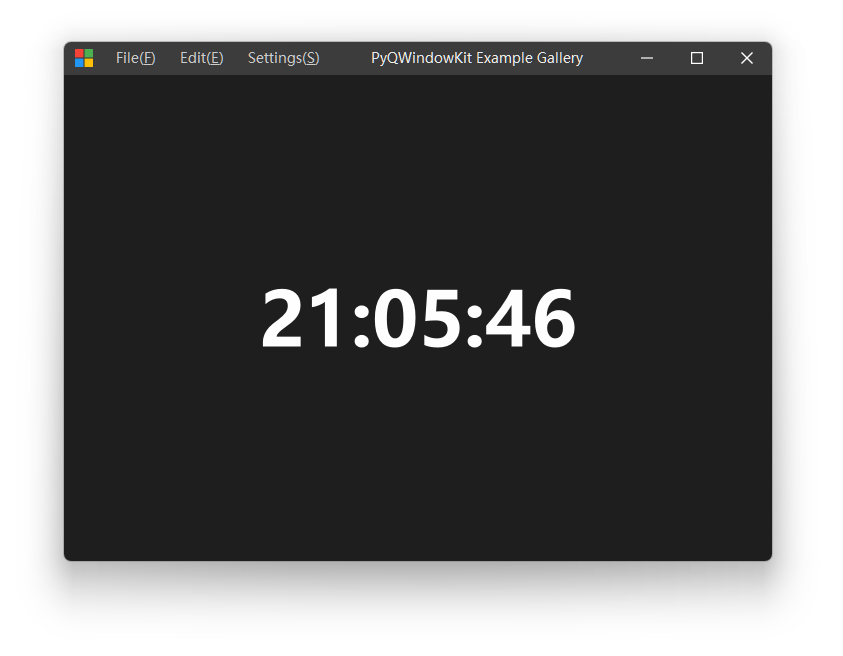

# PyQWindowKit Demo Project

[中文介绍](README_zh_CN.md)

This repository contains a demonstration of how to generate Python bindings for QWindowKit using Shiboken6, and includes a Python-based Gallery application showcasing the library's capabilities.

## Project Overview

The project consists of two main parts:
1.  **Binding Generation**: Uses CMake and Shiboken6 to generate Python bindings for the QWindowKit C++ library.
2.  **Gallery Demo**: A pure Python application (located in the `gallery/` directory) that utilizes the generated bindings to create a modern, frameless window application with native system effects (Mica, Acrylic, etc.).

## Prerequisites

*   **CMake**: 3.20 or higher
*   **Qt**: 6.x (Matching your PySide6 version)
*   **Python**: 3.8 or higher
*   **Dependencies**:
    *   `shiboken6`
    *   `PySide6`
    *   `shiboken6_generator` (Supports the `shiboken_generator_create_binding` CMake function)

> Use the Release build configuration for the entire build and installation process.
> shiboken_generator_create_binding is the core command. It simultaneously performs "code generation" and "extension module compilation", and depends on bindings.h (export list) and the typesystem file (mapping rules);

## Project Structure
*   `CMakeLists.txt`: Main CMake build configuration file.
*   `pyproject.toml`: Used to define the build system requirements for the Python package.
*   `test_quick.py`: A simple script for testing QWK::Quick bindings.
*   `test_widgets.py`: A simple script for testing QWK::Widgets bindings.
*   `test_core.py`: A simple script for testing QWK::Core bindings.
*   `verify_build.py`: Verifies if the PyQWindowKit build was successful.
*   `bindings/`: XML typesystem files for Shiboken.
*   `scripts/`: Helper scripts for binding generation.
*   `gallery/`: Python example application using the PyQWindowKit library.

## Quick Start
> Developed on Windows platform using Visual Studio 2022.
> Ensure the Qt version is consistent with the installed versions of PySide6, etc.

1.  Open a command-line tool in the root directory, enter `.\setup_venv.ps1` to create a virtual environment and install the required packages. (Enter `.\activate_venv.ps1` to activate the virtual environment.)
2.  Modify the Qt installation path in the `CMakeSettings.json` file, and the paths for the QWindowKit installation path `DQWK_DIR` and the Python interpreter `PYTHON_EXECUTABLE`.
3.  Use Visual Studio 2022 to open the `CMakeLists.txt` file in the root directory, select the Release configuration for building and installation.
4.  Run the `test_quick.py`, `test_widgets.py`, and `test_core.py` scripts to verify if the bindings are working correctly.
5. Modify the `cmake.args` parameter in `pyproject.toml` to be consistent with Step 2.
6.  Enter `pip install .` in the command line to package PyQWindowKit into a Python Wheel (and install it into the virtual environment).
7.  Run `python gallery/main.py` in the command line to start the Gallery sample application.

---

## Preliminary Preparation

### Create a Python Virtual Environment and Install Dependencies
Use the command `python -m venv <venv_name>` to create a new virtual environment. After activation using `./<venv_name>/Scripts/activate` (on Windows) or `source <venv_name>/bin/activate` (on macOS/Linux), install the dependency packages.

You can install the Python dependencies via pip:
```bash
pip install shiboken6 PySide6 shiboken6_generator
```
Alternatively, install the latest Python dependencies from the Qt official website:
```bash
pip install --index-url=https://download.qt.io/official_releases/QtForPython/ --trusted-host download.qt.io shiboken6 pyside6 shiboken6_generator
```

### Building and Installing the QWindowKit Library
Before generating the bindings, you need to build and install the QWindowKit library first. Please refer to the https://github.com/stdware/qwindowkit .

Execute the following commands to build and install QWindowKit:
```bash
git clone --recursive https://github.com/stdware/qwindowkit
cd qwindowkit
cmake -B build -S . -DCMAKE_PREFIX_PATH="<QT_INSTALL_DIR>" \
                    -DQWINDOWKIT_BUILD_QUICK=TRUE \           # Optional
                    -DCMAKE_INSTALL_PREFIX="<QWINDOWKIT_INSTALL_DIR>" \
                    -G "Ninja Multi-Config"
cmake --build build --target install --config Release
```
- Use `-DCMAKE_PREFIX_PATH` to specify your Qt installation path.
- Use `-DQWINDOWKIT_BUILD_QUICK=TRUE` to enable the build of the QWindowKit Quick module.
- Use `-DCMAKE_INSTALL_PREFIX` to specify the installation path for QWindowKit.

> **Note**: Please install the Release version of QWindowKit to ensure compatibility with the binding generation process (The PySide6 and Shiboken6 packages are built as Release versions) .

## Configuration, Building, and Installation of the PyQWindowKit Library

Execute the following commands to build the PyQWindowKit bindings:
```bash
# Configure
cmake -S . -B build -G "Ninja" -DCMAKE_BUILD_TYPE=Release \
         -DCMAKE_PREFIX_PATH="<QT_INSTALL_DIR>" \
         -DQWK_DIR="<QWINDOWKIT_INSTALL_DIR>" \
         -DPython_EXECUTABLE="<PATH_TO_YOUR_PYTHON_EXECUTABLE>"
# Build
cmake --build build --config Release
```
> *Note: Ensure that `cmake` can find your Python environment, Qt installation path, and QWindowKit installation path.* 

If you execute `cmake` within a virtual environment, there is no need to specify the `-DPython_EXECUTABLE` parameter. If you are not in a virtual environment and do not specify the Python interpreter path, the system's default Python interpreter will be used.
QWindowKit is installed in the `./install` directory by default. If QWindowKit is installed elsewhere, use the `-DQWK_DIR` parameter to specify its location.

Execute the following command to install the PyQWindowKit library:
```bash
# Install
cmake --install build --prefix <OUT_INSTALL_DIR> --config Release
```

## Testing
`test_quick.py`, `test_widgets.py`, and `test_core.py` are simple scripts for testing the QWK::Quick, QWK::Widgets, and QWK::Core bindings, respectively. You can run these scripts to verify if the bindings are working correctly. For example:
```bash
python test_quick.py
```
> Note: Replace `install_dir` with the path `<OUT_INSTALL_DIR>` you specified when installing PyQWindowKit.

## Packaging PyQWindowKit as a Python Wheel
Use the following command to package PyQWindowKit into a Python Wheel:
```bash
pip install .
```

## Running the Python Gallery

The `gallery/` directory contains a Python port of the QWindowKit Gallery example. It demonstrates the following features :
*   Frameless window implementation.
*   Custom title bar with system buttons.
*   Native window effects (Mica, Acrylic, DWM Blur) on Windows.
*   Theme switching (Dark/Light).

### How to Run

1.  Ensure you have successfully built the bindings.
2.  Set the `PYTHONPATH` environment variable to include the directory where the `PyQWindowKit` module was generated (usually your build output directory, e.g., `build/`).
3.  Run the main script:

```bash
# Example (adjust paths as necessary)
# On Windows (PowerShell)
$env:PYTHONPATH = "path\to\build\output;$env:PYTHONPATH"
python gallery\main.py

# On macOS/Linux
export PYTHONPATH="path/to/build/output:$PYTHONPATH"
python gallery/main.py
```



## Features

*   **Cross-Platform**: Designed to work on Windows, macOS, and Linux (though some effects are Windows-specific) .
*   **Native Integration**: Uses QWindowKit to interact with native windowing APIs .
*   **Highly Customizable**: Full control over the title bar and window behavior via Python .

## Acknowledgements

Thanks to the help of the following open source projects:
- https://github.com/Darcy-C/Shiboken6Demo
- https://github.com/ozguronsoy/SimpleMapView/tree/main
- https://github.com/refeyn/QuickGraphLib/tree/master
